# 💫 About Me:

I build full-stack web applications with the MERN stack, focused on clean UI, scalable backend architecture, and production-ready deployment. 
I work with modern engineering practices like Docker, CI/CD, microservices, Kafka, load balancing, and cloud hosting to build reliable web systems. 
I enjoy turning ideas into usable products, improving developer workflows, and collaborating on projects that solve real problems. 
Strong foundation in problem-solving, backend systems, APIs, databases, and modern frontend development. 
When I'm not coding, I'm probably listening to music and thinking about the next thing to build. ♥️

## 🌐 Socials:

# 💻 Tech Stack:

### Languages

### Frontend

### Backend

### Databases

### Cloud and Deployment

### Developer Tools

# 📊 GitHub Stats:

  

## 🧑‍💻 Most Used Languages

  
  

## 📈 Contribution Overview

  

## 🏆 GitHub Trophies

  

## ✍️ Random Dev Quote

  

---

  

